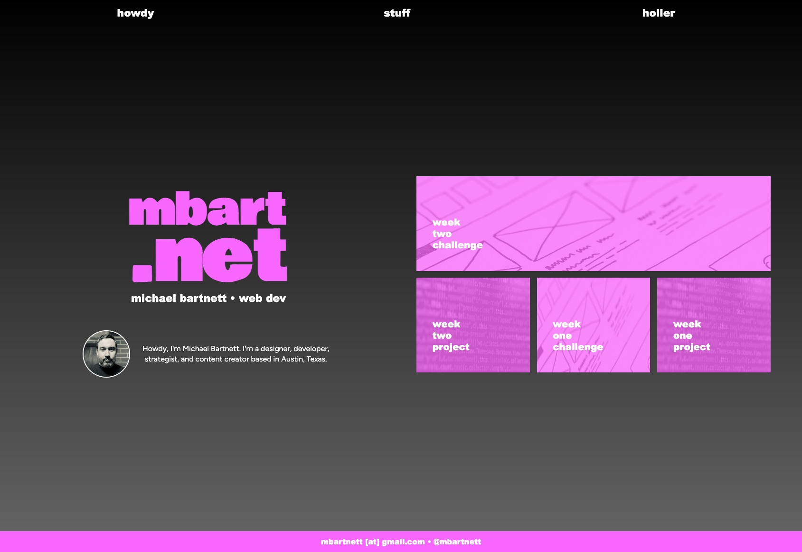

# Week Two Challenge
A portfolio page that I will add to as I progress through the Coding Bootcamp at UT Austin 

## Description

This webpage tested my ability to develop a responsive CSS layout, as well as other advanced CSS and a semantic HTML framework.

## Links

[**Week Two Challenge**](https://mbartnett.github.io/week-2-challenge/) 
[**Week Two Challenge Repo**](https://github.com/mbartnett/week-2-challenge)

## Screengrabs

## License

Please refer to the LICENSE in the repo.
